# Photo Studio Management System - User Documentation

## 1. Introduction

This is the Photo Studio Management System. This document outlines the features and workflows for all users, from standard members to system administrators. The system is designed to manage user accounts, studio events, and equipment reservations.

**Key Features:**
- User account management with role-based access control
- Event scheduling and staff assignment
- Equipment inventory management and reservations
- Approval workflows for reservations
- Automated email notifications
- Time-window based equipment availability checks
- Soft-delete and data anonymization for GDPR compliance

## 2. User Roles & Permissions

The system operates with a tiered hierarchy of user roles, each with specific permissions:

* **USER:**
    * Manage their own profile (update details, change password).
    * View available equipment.
    * Create equipment reservations for personal use or for events they are assigned to.
    * Cancel their own reservations.
    * View event details.

* **MODERATOR:**
    * All **USER** permissions.
    * Create, update, and cancel events.
    * Approve or reject pending event requests.
    * Approve or reject pending equipment reservations.
    * View all user profiles and reservation lists.

* **ADMIN:**
    * All **MODERATOR** permissions.
    * Manage the equipment inventory (add, update, delete equipment).
    * Manage all user accounts (except other **ADMINS** or **SUPER\_ADMINS**).
    * Change user roles (to **USER** or **MODERATOR**).
    * Manage events (create, update, cancel).
    * Set a user's "**Active Member**" status.

* **SUPER\_ADMIN:**
    * Only one exists. Only role is to manage accounts and assign **ADMIN** roles. Cannot be modified by anyone else.

---

## 3. Account Management (All Users)

### 3.1. Registration

1.  Complete the registration form with your name, email, username, phone number, and password.
2.  You will receive an email with a verification link.
3.  Click the link to activate your account.
    > **Note:** The verification token is valid for 30 minutes. If it expires, you must restart the registration process.

**Registration Form View:**

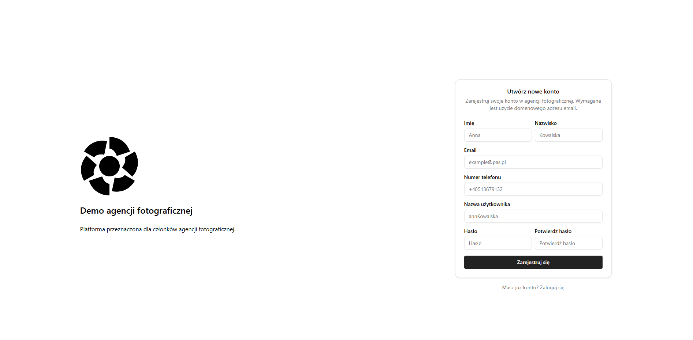

**Registration Requirements:**
- **Name & Surname:** Must be at least 2 characters
- **Email:** Must be a valid, unique email address
- **Username:** Must be unique and 5-20 characters (alphanumeric, dots, underscores)
- **Phone Number:** Valid international format (e.g., +48123456789) or 9 digits without prefix
- **Password:** Minimum 8 characters, must include uppercase, lowercase, numbers, and special characters (@$!%*?&)

### 3.2. Login & Password Reset
* **Login:** Use your registered email address and password.

**Login Form View:**

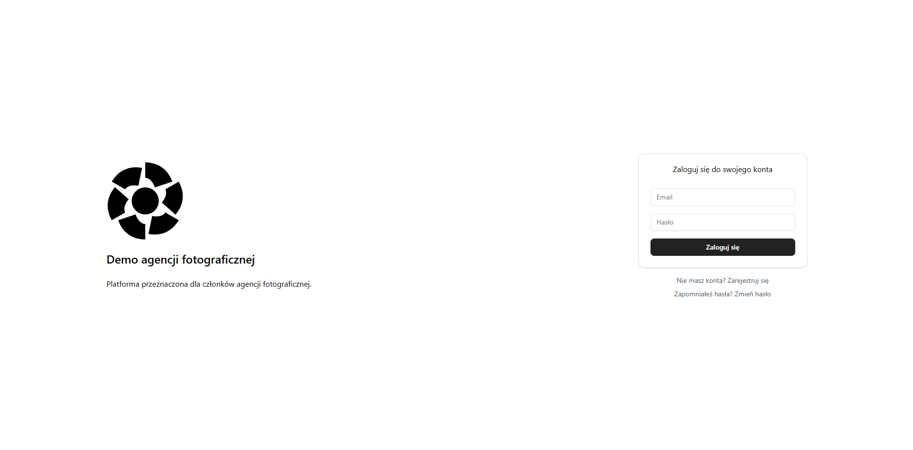

* **Forgot Password:**
    1.  Use the "Forgot Password" feature on the login page.
    2.  Enter your email address.
    3.  You will receive an email with a password reset link.
    4.  Follow the link to set a new password.
    5.  The password reset link is valid for **30 minutes**.

**Login Tips:**
- Password reset tokens are single-use and expire after 30 minutes
- If your token expires, request a new password reset

### 3.3. Profile Management
From your profile, you can:
- Edit your personal details (name, surname, phone)
- Change your password using the dedicated password change form
- View your current role and system access level
- See your Active Member status (if applicable)

**Main Navigation and Sidebar:**

The sidebar navigation provides quick access to all major system features:
- **Home/Dashboard:** Overview of your upcoming events and reservations
- **Events:** Browse events, view details, and manage your participation
- **Equipment:** Search, view details, and manage your equipment reservations
- **Administration:** Admin features (for admins/moderators only)
- **Logout:** Sign out of your account
- **Requests:** View pending event requests and equipment reservations (for moderators/admins)

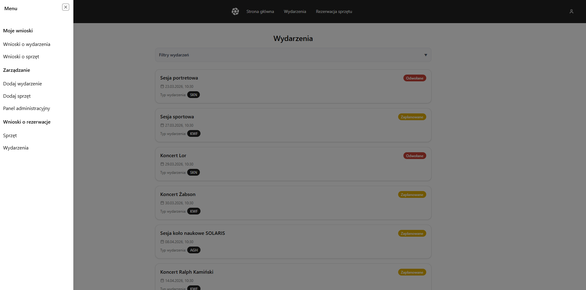

---

## 3.4. Events Section

Events are the core of the Photo Studio Management System. They represent scheduled photoshoots, conferences, or other activities that require staff participation and equipment.

**Events List View:**
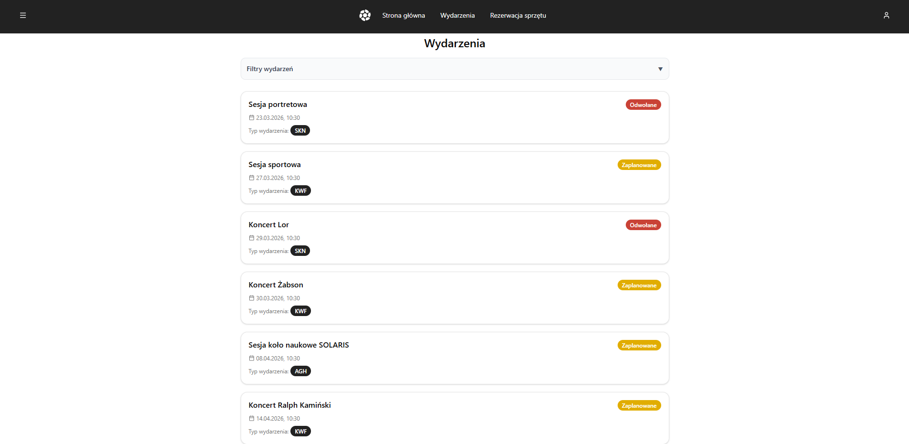

**Understanding Events:**
- Events have a scheduled date, time, location, and type
- Events require a specified number of staff members
- Each event progresses through a lifecycle: PLANNED → COMPLETED or CANCELLED
- Users can apply to participate in events

**Events Details View:**
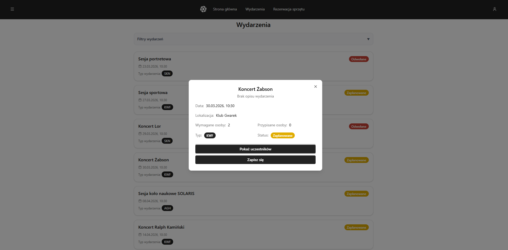

**For Regular Users:**
- Browse all available events
- View event details (date, time, location, staff requirements)
- Apply to participate in an event (click "Join Event")
- View your assigned events
- Check which events need equipment reservations
- View assigned personnel to events

**For Admins:**
- Create new events with full details
- Edit event information -time, location, type, staff count (only for PLANNED events)
- Mark events as completed or cancel them (ADMINS only)

The Events section works closely with the Equipment Reservation system - once you're assigned to an event, you may need to reserve equipment for that event's duration.

## 4. Equipment Reservation (User Flow)

This is the core feature for **USERS**.

### 4.1. Reservation Eligibility
Your ability to reserve certain equipment depends on two factors:

1.  **Active Member Status:** Some equipment is restricted to "Active Members" only. This status is granted by an **ADMIN**.
2.  **Statutory Event Flag:** Some equipment is designated for "Statutory Events" only. This equipment **cannot** be reserved for personal use (i.e., without linking it to a valid event).

### 4.2. Viewing Equipment Reservations & Search

You can view all your past and upcoming reservations, including the status of each item. This allows you to check if yout request has been approved, is still pending, or if any items were rejected, as well as analyze your reservation history.

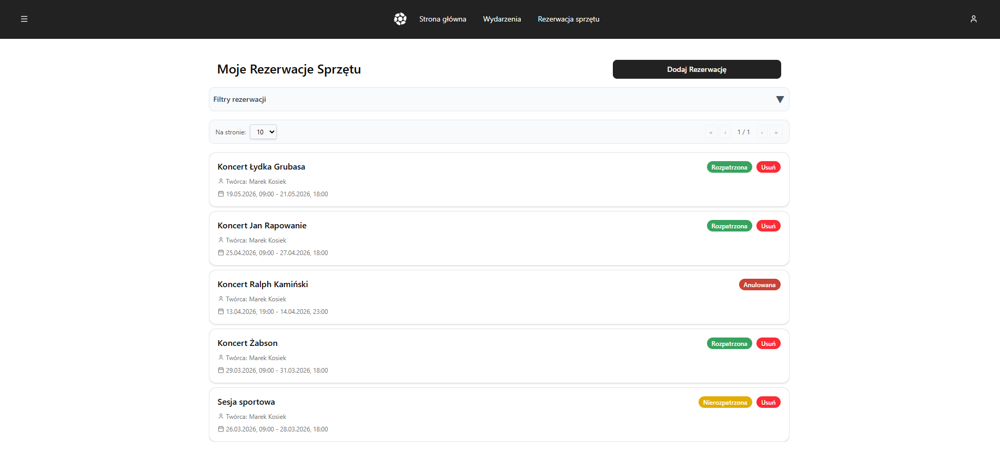

To find specific reservations, you can use the search and filter options.

**Search Parameters:**
- **Event Name:** Filter by the name of the event to which the reservation is linked
- **Start/End Date/Time:** Dates of your reservation
- **Status:** Filter by reservation status

The system performs **collision detection** to ensure:
- Equipment is not double-booked
- Your reservation duration doesn't conflict with approved or pending reservations from other users
- You haven't exceeded your equipment category limits per user per category setting

### 4.3. Creating a New Reservation
All new reservations are created with a **NOT_RESOLVED** status and must be approved by a **MODERATOR** or **ADMIN**.

**Creating a Reservation:**

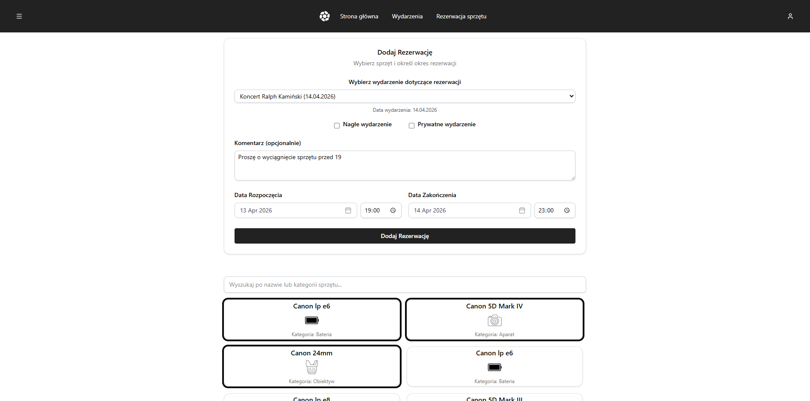

* **Standard (Personal) Reservation:**
    * Select equipment and a time range.
    * Mark as **Private** if it's a personal use reservation.
    * Mark as **Urgent** if it's a last-minute statuory event without created event.

* **Event-Linked Reservation:**
    * You must first have **PENDING** or **APPROVED** status for the event request.
    * When creating the reservation, you must link it to the event.
    * The system will validate that:
        * You are assigned to the event.
        * The event status is **PLANNED**.
        * The reservation dates fall within the event's date.
    * Event-linked reservations may have different approval workflows.

**Reservation Status Hierarchy:**
Each equipment reservation has an overall status and individual item statuses:
- **Reservation Status** (overall):
  - **NOT_RESOLVED:** Items are still pending review (contains PENDING or APPROVED items)
  - **RESOLVED:** All items have been finalized (all items are APPROVED, REJECTED, or CANCELLED)
  - **CANCELLED:** The entire reservation has been cancelled

- **Item Status** (per equipment):
  - **PENDING:** Awaiting moderator/admin approval
  - **APPROVED:** Confirmed - equipment is booked for you
  - **REJECTED:** Declined by moderator/admin
  - **CANCELLED:** Cancelled by you or cascaded from event cancellation


**Reservation Details:**

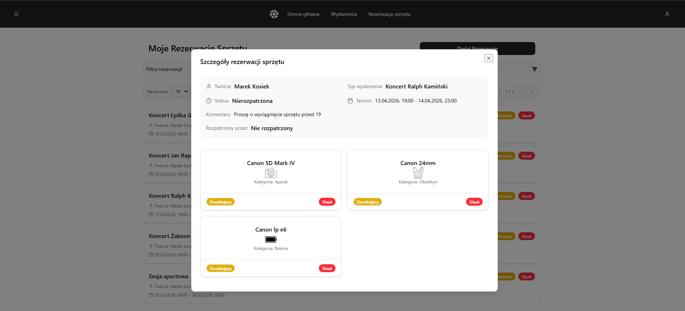

You can **CANCEL** individual equipment items within your reservation, provided:
* The item status is **PENDING** or **APPROVED**.
* The reservation's start time has not already passed.

You can also cancel the entire reservation:
* Cancelling all items will cascade to mark the reservation as **CANCELLED**.

**Item Status Meanings:**
- **PENDING:** Awaiting moderator/admin approval
- **APPROVED:** Confirmed - equipment is booked for you
- **REJECTED:** Declined by moderator/admin
- **CANCELLED:** Cancelled by you or cascaded from event cancellation

**Reservation-Level Status Meanings:**
- **NOT_RESOLVED:** The reservation contains items still being reviewed (PENDING or APPROVED states)
- **RESOLVED:** All items in the reservation have final decisions (all are APPROVED, REJECTED, or CANCELLED)
- **CANCELLED:** You cancelled the entire reservation

**Important:** If an event linked to your reservation is cancelled, all reservation items for that event will automatically be **REJECTED** with a notification email.

## 5. Moderator & Admin Guide

### 5.1. Event Management
**MODERATORS** and above can manage the full lifecycle of an event.


**Create Event:** Define the event's name, location, date/time, type, and number of people required.

**Create Event Form:**

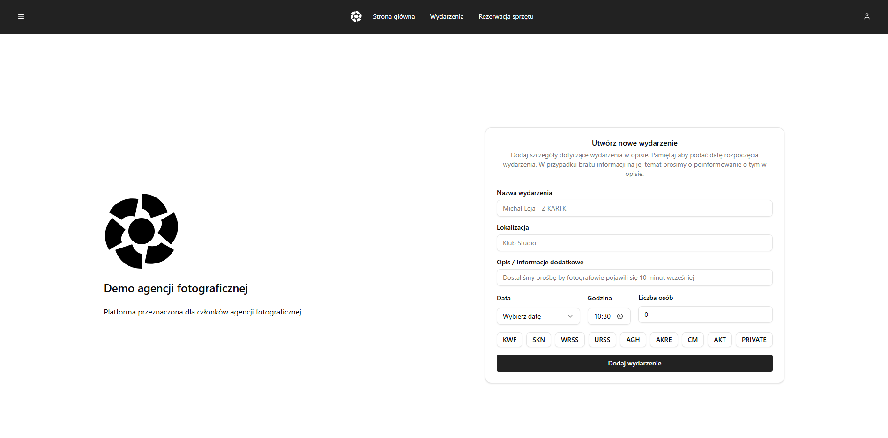

**Event Creation Fields:**
- **Name:** Event title (e.g., "Company Photoshoot", "Wedding Reception")
- **Date & Time:** Must be in the future
- **Location:** Where the event takes place
- **Event Type:** Choose from the following:
  - **KWF** - Concerts/Musical Events
  - **SKN** - Student Organizations Events
  - **WRSS** - WRSS Events
  - **URSS** - URSS Events
  - **AGH** - AGH-related Events
  - **AKRE** - Accreditation Events
  - **CM** - Cultural/Media Events
  - **AKT** - Other Events
  - **PRIVATE** - Private Events
- **Number of People Required:** How many staff members needed

* **Update Event:** Modify the details of a **PLANNED** event.

**Edit Event Form:**

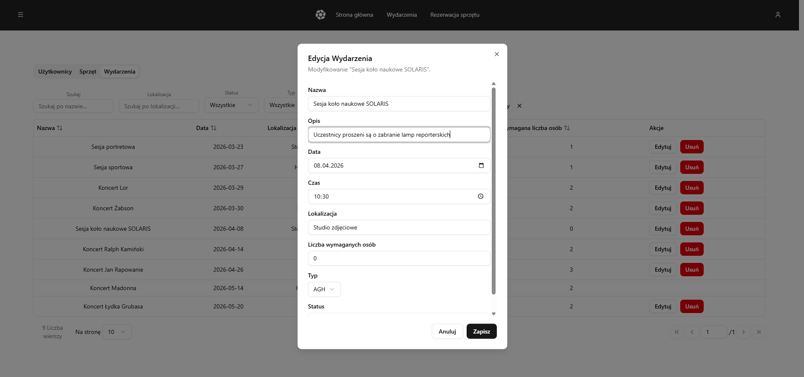

    > **Note:** Updating an event will automatically send an email notification to all assigned participants.
    
* **Cancel Event:**
    * This sets the event status to **CANCELLED**.
    > **Important Cascade:** Cancelling an event will **automatically reject all** associated equipment reservations for all users and send an email notification to all participants.
    
* **Complete Event:** Mark an event as **COMPLETED** after it has occurred.

**Event Status Lifecycle:**
```
PLANNED → (Update details, add/remove staff) → COMPLETED or CANCELLED
```

### 5.2. Reservation Management
**MODERATORS** and above are responsible for managing all equipment reservations.

**All Equipment Reservations (Moderator View):**

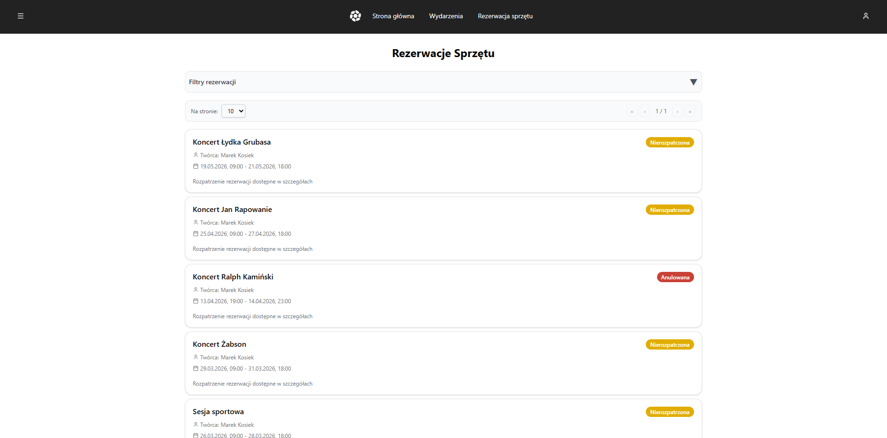

**Resolve/Approve Equipment Reservations:**

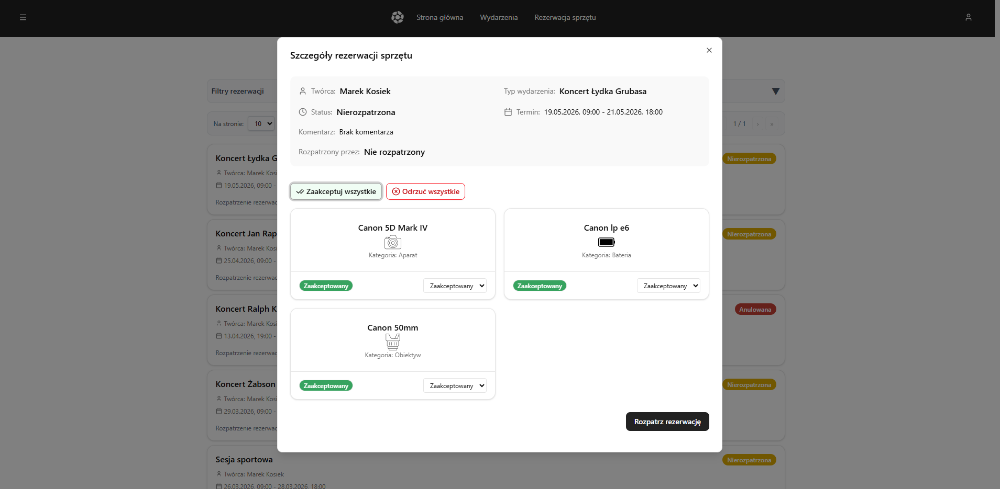

* View all reservations containing **PENDING** equipment items (items awaiting approval).
* **Approve:** Confirms specific equipment items for the reservation. The equipment is now officially booked.
* **Reject:** Rejects specific items in the reservation. The equipment becomes available again.
* **Modify:** Change approval decisions for individual items in an already-resolved reservation.

**Understanding the Resolution Process:**
When a user creates a reservation, they request multiple equipment items. Each item starts in **PENDING** status. As moderators, you decide:
1. Which items to **APPROVE** (confirm booking)
2. Which items to **REJECT** (decline booking)
3. You can **MODIFY** these decisions after initial approval

Once all items reach their final state (APPROVED, REJECTED, or CANCELLED), the overall reservation moves to **RESOLVED** status.

**Detailed Resolution Interface:**


**Handling Event Requests (Applications):**

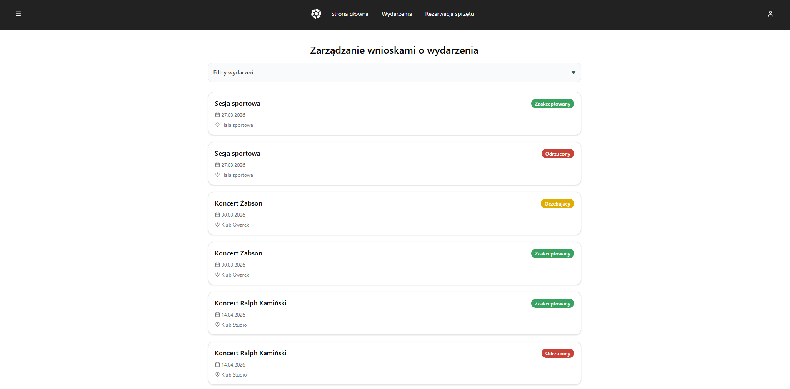

**Individual Event Request:**

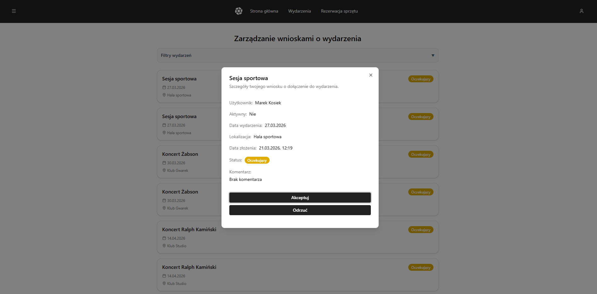

* Review users who have applied to participate in events.
* **Approve:** Add the user to the event staff.
* **Reject:** Decline the application.
* Rejected applications do NOT assign users to the event.

---

## 6. Admin & Super Admin Guide

### 6.1. User Management
**ADMINS** and above can manage user accounts.

* **Change User Role:** Assign or change a user's role (e.g., promote a **USER** to **MODERATOR**).
    * An **ADMIN** cannot modify other **ADMINS** or the **SUPER\_ADMIN**.
    * Available roles: USER, MODERATOR, ADMIN
    
* **Set Active Member Status:** Grant or revoke a user's "Active Member" status, which affects their equipment eligibility.
    * Active members have access to all equipment, including items restricted to active members only.
    * This status can be toggled per user by ADMINs
    
* **Delete User:** Anonymize and deactivate a user account.
    * This is a **soft-delete** for GDPR compliance
    * User data is anonymized (name, email, etc.)
    * User cannot log in after deletion
    * All future reservations are automatically cancelled

**User Management Best Practices:**
- Only promote to MODERATOR/ADMIN users you trust
- Regularly review Active Member status during performance reviews
- Document user deletions for compliance purposes

### 6.2. Equipment (Inventory) Management
**ADMINS** and above control the equipment inventory.

**Equipment Admin Panel View:**

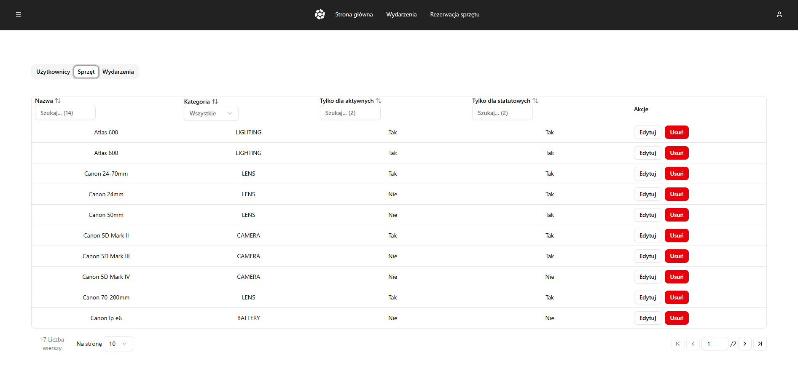

**Event Admin Panel View:**

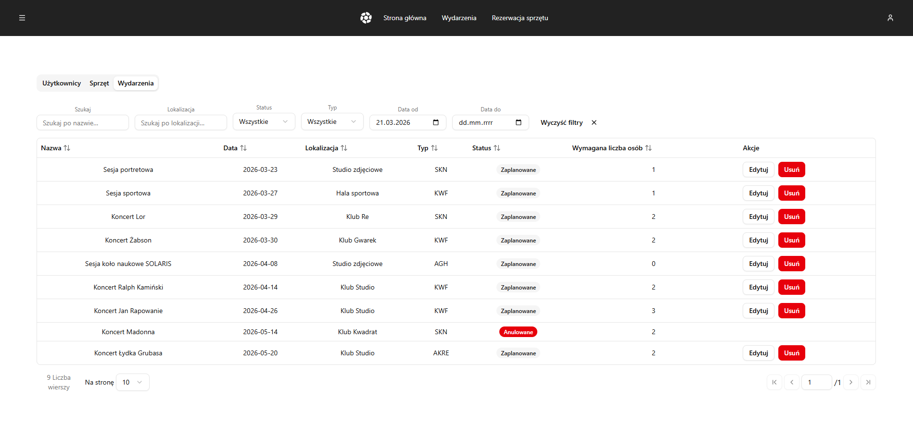

* **Create Equipment:** Add new equipment to the system. You must define:
    * Name & Category
    * **Active Member Flag:** (Is this item only for active members?)
    * **Statutory Event Flag:** (Is this item only for statutory events?)
    
**Equipment Categories:**
- CAMERA - Professional cameras and bodies
- LENS - Lenses and optical equipment  
- BATTERY - Batteries and power supplies
- STUDIO - Studio equipment (backdrops, props, etc.)
- LIGHTING - Strobes, continuous lights, modifiers
- TRIPOD - Tripods and stabilization equipment
- ACCESSORIES - Filters, cables, adapters, etc.

* **Update Equipment:** Change the name or flags of existing equipment. The category cannot be changed after creation.

* **Delete Equipment:** Marks the equipment as "deleted," preventing any new reservations.
    > **Warning:** This action does *not* automatically cancel existing reservations. A log warning is generated, and a moderator must manually cancel any future bookings for that item.

**Equipment Status:**
- **Deleted:** Unavailable for new reservations

---

## 7. Automated Notifications

The system will automatically send you emails for key events:

* **Account Verification:** On new user registration.
* **Password Reset:** When you request a password reset.
* **Event Modified:** When an event you are assigned to is updated.
* **Event Cancelled:** When an event you are assigned to is cancelled.
* **Reservation Approved:** When your equipment reservation is approved.
* **Reservation Rejected:** When your equipment reservation is rejected.
* **Event Assignment:** When you are added to or removed from an event.


## 12. Terminology

| Term | Definition |
|------|-----------|
| **Active Member** | User status granting access to all equipment |
| **Approval Flow** | Process where MODERATOR reviews and approves pending reservations |
| **Equipment Category** | Classification of equipment (CAMERA, LENS, LIGHTING, etc.) |
| **Event Type** | Classification of events (KWF, SKN, PRIVATE, etc.) |
| **Pending** | Status waiting for moderator/admin action |
| **Role** | User's permission level (USER, MODERATOR, ADMIN, SUPER_ADMIN) |
| **Statutory Event** | Official/formal event (vs. personal/private events) |
| **Token** | Temporary code sent to email for verification or password reset |

---
